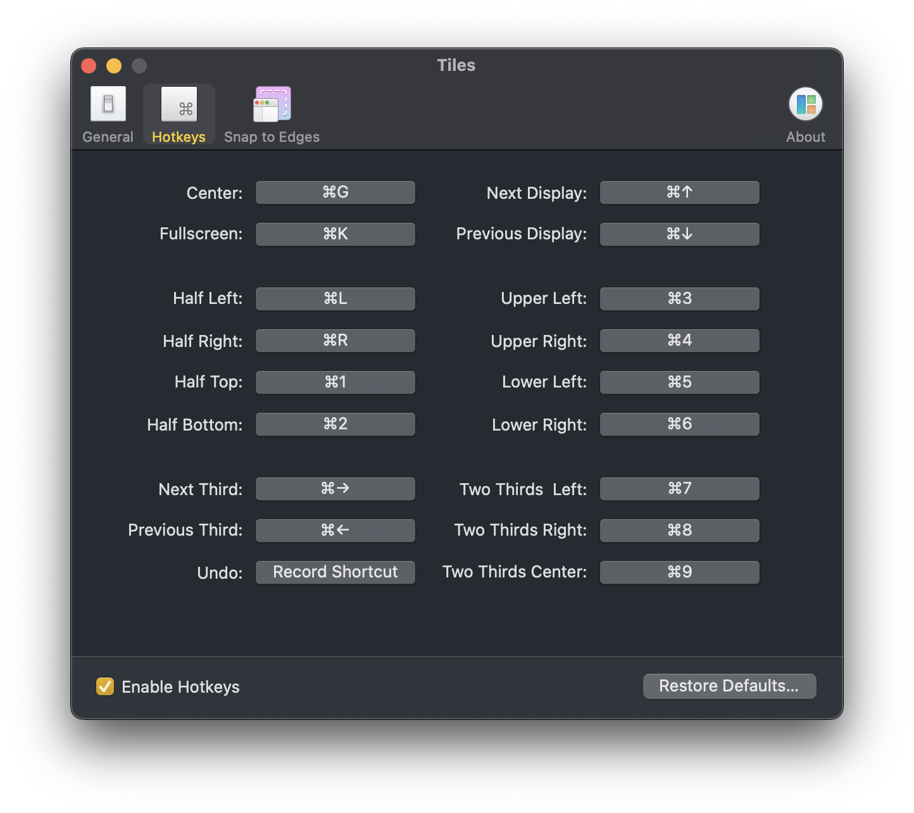
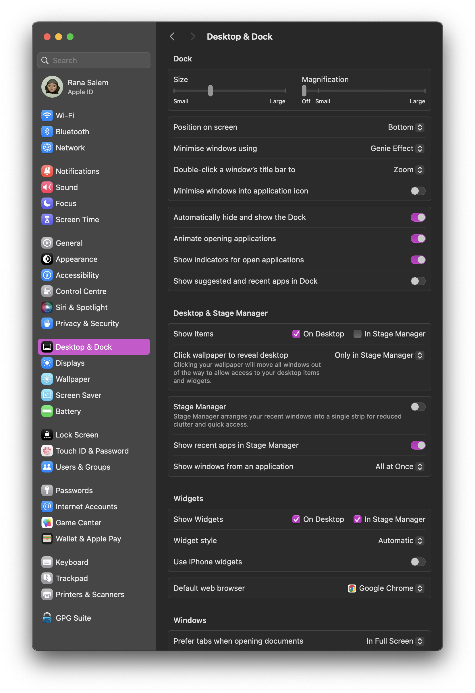
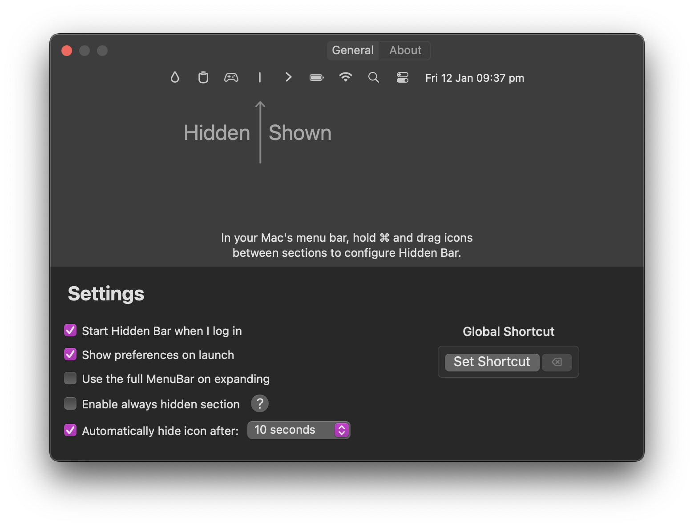
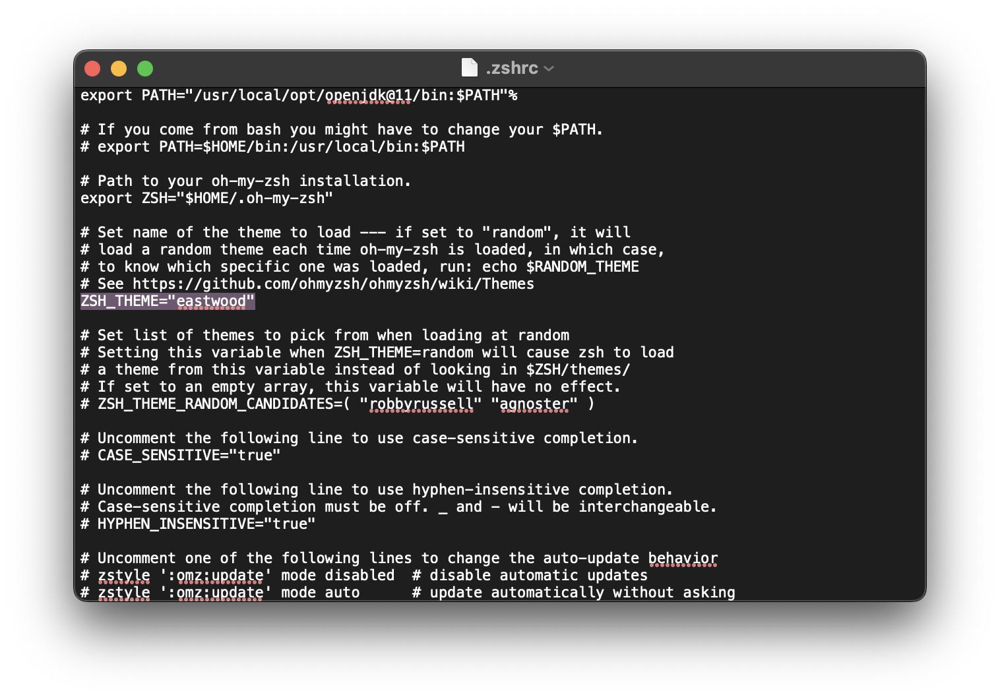

# MacBook Config Guide

This document serves as a complete guide to setting up a MacBook for personal use (not that some of this setup overlaps with the [Defra setup](/defra-setup/index.md) and vice versa).
## Housekeeping

1. Sign into Apple/iCloud (typically prompted via System Settings)
2. Arrange Control Centre (hold `cmd` and drag the symbols to order them as preferred - note this chages slightly after installing Hidden Bar, the instructions for which are provided a little later on):

3. [Install Tiles](https://freemacsoft.net/tiles/) and add the following hot keys:

4. Open `System Settings` > `Appearance` and choose `Dark Mode` and whichever accent colour.
5. Open `System Settings` > `Displays` and toggle off `Automatically adjust brightness`.
6. Open `System Settings` > `Desktop & Dock` and ensure the set-up matches the settings below:

7. [Download Google Chrome](https://www.google.com/intl/en_uk/chrome/?_gl=1*1ec694r*_up*MQ..*_ga*MTU5MTkxNjYwMy4xNzA1MDk1MzAy*_ga_B7W0ZKZYDK*MTcwNTA5NTMwMS4xLjAuMTcwNTA5NTMwMS4wLjAuMA..) and set it as the default browser (see step 6 for where to do this). Once installed, sign into Chrome using your Gmail account, but consider whether you should sync your Chrome set up from another device (e.g. bookmarks & [extensions](extensions/google-chrome-extensions.md)) to a new device. On a work device you likely want different bookmarks saved and might need or not be allowed to install all the extensions you typically use.
8. [Install Hidden Bar](https://apps.apple.com/gb/app/hidden-bar/id1452453066?mt=12). This is a toolbar extension which helps to declutter the Mac toolbar/control centre. Once installed, open the application and ensure the settings match those shown below:

9. Arrange which icons to hide/show in the toolbar exactly how it was done in step 2 i.e. holding `cmd` and dragging to re-arrange.
10. Open `System Settings` > `Trackpad` and ensure `Tap to click` is turned on. Set `Press fn key` to `Show Emoji & Symbols`. Under `Touch Bar Settings` turn off `Show typing suggestions`. Set `Keyboard navigation` to on.
11. Open `System Settings` > `General` > `AirDrop & Handoff` and turn off `Allow Handoff between this Mac and your iCloud devices`.
12. Open `System Settings` > `Focus` and delete all Focus profiles except `Do Not Disturb` and set `Share across devices` to off.
13. Open `System Settings` > `Notifications` and configure notifications for all applications listed to however preferred (this varies on what the machine is used for e.g. as a personal or work device).
14. Install [Oh-My-Zsh](https://ohmyz.sh/). This is a framework for customising the Zsh (terminal) configuration. It comes with a bunch of useful plugins and themes. Go into your home directory on your machine and press `cmd` + `Shift` + `.` to view all hidden files. Open the `.zshrc` file and be sure to set your theme after installing Oh-My-Zsh to `eastwood`:

Within the same file, specify which plugins should be valid. Configuring plugins in the `.zshrc` will look like this (for the time being I just have the `git` and `docker-compose` plugins active): 
```
plugins=(git docker-compose)
```
15. Copy and paste the config from the `.zshrc.pre-oh-my-zsh` (this is what the `.zshrc` file is renamed too after installing Oh-My-Zsh). To do this, open terminal and run the command: `cat .zshrc.pre-oh-my-zsh`, copy the entire output and paste this into the `.zshrc` file.

## Apps

[Homebrew can install a bunch of these apps](brew-install-commands.md), if not all of them.

- [Bitwarden](https://apps.apple.com/gb/app/bitwarden/id1352778147?mt=12)
- [Surfshark](https://surfshark.com/download)
- [Spotify](https://www.spotify.com/de-en/download/mac/)
- Microsoft Office 365
	- [Word](https://apps.apple.com/gb/app/microsoft-word/id462054704?mt=12)
	- [PowerPoint](https://apps.apple.com/gb/app/microsoft-powerpoint/id462062816?mt=12)
	- [Excel](https://apps.apple.com/gb/app/microsoft-excel/id462058435?mt=12)
	- [Outlook](https://apps.apple.com/gb/app/microsoft-outlook/id985367838?mt=12)
	- [Teams](https://www.microsoft.com/en-gb/microsoft-teams/download-app)
- [Zoom](https://zoom.us/download) - this one's optional, haven't used it in ages
- [Whatsapp](https://www.whatsapp.com/download)
- [Facebook Messenger](https://www.messenger.com/desktop?locale=en_GB)
- [Numi](https://numi.app/)
- [Notion](https://www.notion.so/desktop)
- [Obsidian](https://obsidian.md/download)
- [Warp](https://www.warp.dev/)
## Software Development

- [Homebrew](https://brew.sh/)
- [VS Code](https://code.visualstudio.com/Download) (don't forget to [set up the config for your VS Code environment](vs-code-config.md)).
- [Git](https://github.com/git-guides/install-git)
- To install Node.js & NPM (Node Package Manager) it is recommended to follow the same installation process detailed in the [Defra set up guide](/defra-setup/index.md#node-version-manager-nvm).
- Bootstrap
  - To install Bootstrap, complete the following within the project/app:
    - Run `npm install bootstrap popper.js` (`Bootstrap` depends on `popper.js` for JS functionality).
    - In the `App.js` import Bootstrap:
      - `import "bootstrap/dist/css/bootstrap.min.css"`
      - `import "bootstrap/dist/js/bootstrap.bundle"`
  - (Note that Bootstrap just needs to be installed per project/app - no global installation is needed, or at least it shouldn't be from what I remember from training)
- [Maven](https://www.youtube.com/watch?v=REPevl2IrQc)
  - Note that when installing Maven, especially when configuring paths, _do not_ just simply copy the paths/commands used in the YouTube video linked above.
  - Check your version of Maven that you are downloading and be sure to update the commands/paths as necessary.
- [Python](https://www.python.org/downloads/)
  - Instructions for installing `Python3` & `PyCharm` are in freeCodeCamp's Python tutorial on YouTube. [Skip to 1:45 for instructions](https://www.youtube.com/watch?v=rfscVS0vtbw&t=105s).
- [PyCharm](https://www.jetbrains.com/pycharm/download/?section=mac) - Python IDE (if needed, but VS Code should be suitable)
  - Scroll down for the free community edition, the professional edition which is shown on the landing page is not free.
  - Instructions can be found in the Python tutorial YouTube link (see above).
  - Make sure to [install PyCharm extensions](extensions/pycharm-extensions.md).
- [Java](https://www.java.com/en/download/help/download_options.html)
- [Eclipse Enterprise Edition](https://www.guru99.com/install-eclipse-java.html) - ensure to download the Enterprise edition and once that's finished, [install extensions used with Eclipse](extensions/eclipse-extensions.md).
- [Postman](https://www.postman.com/downloads/)
- [Figma](https://www.figma.com/downloads/)
- [Docker Desktop](https://docs.docker.com/desktop/install/mac-install/)
  - Open `Settings` > `Kubernetes` > check the box that says `Enable Kubernetes` > click `Apply`.
- Environment Variables
  - The set up for `.env` files across any project or a group of related projects is the same as what is currently described in the [Defra set up guide](/defra-setup/index.md#env-set-up).

## A note on Terminals
If for whatever reason permission issues block you from running certain commands on a group of files e.g. `code .`, `cd`, etc. then complete the follwing:
- `System Settings` > `Privacy & Security` > `Files and Folders` > select `Terminal` or `Warp` (whichever one is having issues) > toggle on any directories for which you need access to via these terminal providets.